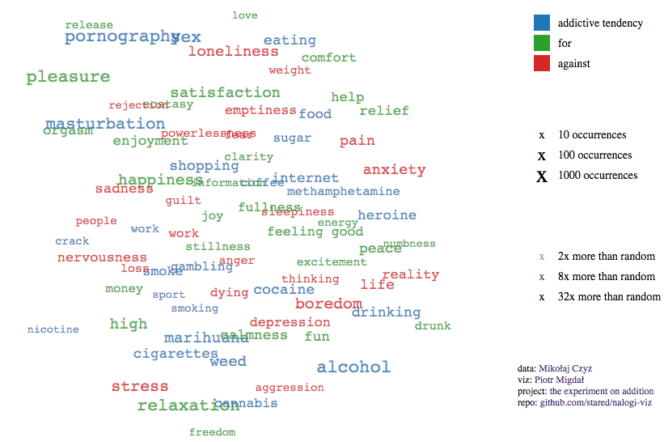
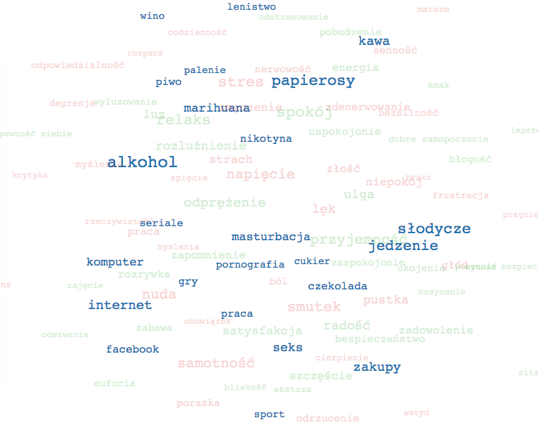

# (english) Addictive tendencies - a magnetic cloud - screenshot

* Raw, on this repo: [p.migdal.pl/nalogi-viz/en.html](http://p.migdal.pl/nalogi-viz/en.html)
* On Mikołaj Czyż blog: [The experiment on addictions early results - coincidence graph](https://mikolajczyz.com/general/research-addictions-results/#cloud)

# (polski) Nałogi: co dają, co zwalczają

Zobacz interaktywną wersję: http://p.migdal.pl/nalogi-viz/

Zaadaptowana wersja: [Graf koincydencji substancji i doświadczeń / pocotorobie.pl](https://mikolajczyz.pl/ogolne/wstepne-wyniki-badania-wizualizacja-piotr-migdal/) - na blogu Mikołaja Czyża

